# FitForge v1 Entity Relationship Diagram

```mermaid
erDiagram
  users ||--|| profiles : has
  users ||--o{ user_goals : pursues
  users ||--o{ user_targets : receives
  users ||--o{ user_dietary_preferences : selects
  dietary_preferences ||--o{ user_dietary_preferences : classifies
  users ||--o{ user_allergens : declares
  allergens ||--o{ user_allergens : classifies
  users ||--o{ user_equipment : owns
  equipment ||--o{ user_equipment : lists

  food_categories ||--o{ foods : groups
  foods ||--o{ food_allergens : contains
  allergens ||--o{ food_allergens : marks

  users o|--o{ recipes : authors
  recipes ||--o{ recipe_ingredients : contains
  foods ||--o{ recipe_ingredients : supplies
  recipes ||--o{ recipe_steps : contains
  recipes ||--o{ recipe_media : displays
  media_assets ||--o{ recipe_media : provides
  recipes ||--o{ recipe_tag_links : tagged
  recipe_tags ||--o{ recipe_tag_links : applies
  recipes ||--o{ recipe_dietary_preferences : supports
  dietary_preferences ||--o{ recipe_dietary_preferences : classifies

  users ||--o{ meal_plans : owns
  meal_plans ||--o{ meal_plan_entries : schedules
  recipes o|--o{ meal_plan_entries : plans
  users ||--o{ meal_logs : records
  meal_plan_entries o|--o{ meal_logs : fulfils
  recipes o|--o{ meal_logs : snapshots
  users ||--o{ shopping_lists : owns
  meal_plans o|--o{ shopping_lists : generates
  shopping_lists ||--o{ shopping_list_items : contains
  foods o|--o{ shopping_list_items : references

  exercise_categories ||--o{ exercises : groups
  exercises ||--o{ exercise_muscle_groups : targets
  muscle_groups ||--o{ exercise_muscle_groups : identifies
  exercises ||--o{ exercise_equipment : requires
  equipment ||--o{ exercise_equipment : provides
  exercises ||--o{ exercise_media : demonstrates
  media_assets ||--o{ exercise_media : provides

  users ||--o{ workout_plans : owns
  workout_plans ||--o{ workout_days : sequences
  workout_days ||--o{ workout_day_exercises : prescribes
  exercises ||--o{ workout_day_exercises : references

  users ||--o{ workout_sessions : performs
  workout_plans o|--o{ workout_sessions : instantiates
  workout_days o|--o{ workout_sessions : instantiates
  workout_sessions ||--o{ workout_session_exercises : contains
  exercises ||--o{ workout_session_exercises : snapshots
  workout_session_exercises ||--o{ exercise_sets : records

  users ||--o{ body_measurements : tracks
  users ||--o{ progress_photos : captures
  media_assets ||--o{ progress_photos : stores
  users ||--o{ daily_habit_logs : logs
  users ||--o{ personal_records : achieves
  exercises o|--o{ personal_records : measures
```

## Aggregate boundaries

- **Profile aggregate:** profile, goals, targets, preferences, allergens and available equipment.
- **Recipe aggregate:** recipe, ingredients, steps, tags, dietary compatibility and media.
- **Meal-plan aggregate:** plan and entries. Meal logs are independent history.
- **Exercise aggregate:** exercise, muscles, equipment and media.
- **Workout-plan aggregate:** plan, days and prescribed exercises.
- **Workout-session aggregate:** session, performed exercises and sets.
- **Progress aggregate:** measurements, habit logs, photos and personal records.

## Ownership rule

All commands and queries involving private data must establish the authenticated user at the repository boundary. A route parameter UUID alone is never sufficient authorization.
